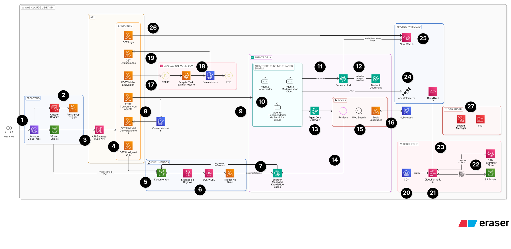

# Asistente RAG Agéntico Empresarial

* Informe de entrega (PDF): [docs/entrega/entrega.pdf](docs/entrega.pdf)
* Video de la solución: [https://www.youtube.com/watch?v=hxTizFkDFQI](https://www.youtube.com/watch?v=hxTizFkDFQI)

Solución a la prueba técnica. Agente RAG empresarial sobre AWS.

* Decisiones técnicas (resumen): [docs/decisiones_short.md](docs/decisiones_short.md)
* Decisiones técnicas (completas): [docs/decisiones_full.md](docs/decisiones_full.md)
* Documentación de la API: [docs/api.md](docs/api.md)
* Evaluación de calidad: [docs/evaluacion.md](docs/evaluacion.md)
* Mejoras futuras: [docs/mejoras-futuras.md](docs/mejoras-futuras.md)
* Riesgos y consideraciones para producción: [docs/riesgos-produccion.md](docs/riesgos-produccion.md)

> **Aviso:** la redacción y generación de la documentación fueron asistidas por IA Generativa, y yo revisé todo el contenido y me encargué 100% del diseño de la solución. Hay más detalles en el docoumento de uso de IA Generativa: [docs/uso-de-ia-generativa.md](docs/uso-de-ia-generativa.md)

## Arquitectura



Toda la solución se despliega en AWS (`us-east-1`). Los números corresponden a los marcadores del diagrama.

### Frontend y autenticación

1. **Frontend.** El usuario realiza todas las operaciones desde el frontend, construido en React con Cloudscape y servido por una distribución de Amazon CloudFront y su bucket de S3. La página de inicio de sesión es el *managed login* de Amazon Cognito.
2. **Identidad.** La autenticación y la identidad se gestionan con un *user pool* de Cognito. Un Lambda *Pre SignUp* restringe el registro a cuentas aprobadas o a dominios de correo corporativos.
3. **API.** El frontend se comunica con el backend mediante una API REST en Amazon API Gateway, protegida con el mismo *user pool* de Cognito. La única excepción es la carga de documentos para la base de conocimiento, que va directo a S3 mediante URLs prefirmadas.

### Ingesta documental

4. **URL prefirmada.** El frontend obtiene la URL prefirmada desde un endpoint dedicado.
5. **Carga.** El documento se sube al bucket de documentos de S3 usando esa URL.
6. **Sincronización.** Cada carga o borrado en el bucket genera un evento de Amazon EventBridge que queda en una cola de Amazon SQS, y un Lambda procesa la cola por lotes para sincronizar la base de conocimiento. Si hay una sincronización en curso que empezó antes del cambio, el lote vuelve a la cola y se reintenta cada 5 minutos hasta que se puede lanzar otra; los eventos que agotan los reintentos quedan en una cola de mensajes fallidos.
7. **Sincronización incremental.** La sincronización es incremental y los documentos se leen únicamente del bucket de documentos (detalles de la base de conocimiento en el paso 14).

### Conversación con el agente

8. **Conversaciones.** El contexto de cada conversación lo administran AgentCore Runtime y AgentCore Memory por sessionId. Un conjunto de endpoints y una tabla de DynamoDB registran los turnos para que cada usuario consulte su historial.
9. **Converse.** La conversación con el agente ocurre en el endpoint de conversación.
10. **Swarm de agentes.** Se usa Strands Agents con el patrón *swarm*, desplegado en Amazon Bedrock AgentCore Runtime. El agente conversacional dialoga con el usuario, gestiona las solicitudes y recupera información de la base de conocimiento. El agente de modernización y el agente recomendador de servicios cloud son agentes especializados para esos casos de uso.
11. **Modelo.** Todos los agentes usan Amazon Nova 2 Lite, por costo: es por mucho el modelo más barato disponible en Amazon Bedrock. El modelo juez de la evaluación es el mismo.
12. **Guardrails.** Amazon Bedrock Guardrails detecta y bloquea ataques de *prompt injection*, tanto en el mensaje del usuario como en la respuesta del modelo. Cuando bloquea uno, el usuario recibe un mensaje indicando que la respuesta fue bloqueada por los guardrails.
13. **Gateway de herramientas.** Todas las herramientas se exponen a los agentes mediante un gateway MCP de AgentCore.
14. **Recuperación (RAG).** La herramienta de recuperación consulta la base de conocimiento e incluye las fuentes para referenciarlas en la respuesta. La base de conocimiento es una Amazon Bedrock Knowledge Base administrada: el vector store, los embeddings, el *chunking*, el *parsing*, la ingesta y el almacenamiento los gestiona el servicio.
15. **Búsqueda web.** Los agentes especializados tienen la herramienta de búsqueda web de AgentCore, con una lista de dominios permitidos limitada a la documentación de AWS y Azure, para evitar desviaciones. El agente conversacional no tiene búsqueda web: responde solo con la información de la base de conocimiento.
16. **Herramientas de solicitudes.** Herramientas basadas en Lambda gestionan las solicitudes (tickets) del sistema. Para cada solicitud el agente puede crearla, consultarla o listarlas, actualizarla con un resumen, con un nivel de prioridad, con un nivel de esfuerzo estimado o con un nuevo estado. La prioridad y el esfuerzo los decide el LLM, con tres niveles posibles: bajo, medio y alto. El agente no puede eliminar solicitudes.

### Evaluación agéntica

17. **Ejecución.** La evaluación agéntica se lanza desde el frontend y corre como una tarea de AWS Fargate orquestada por AWS Step Functions, con Strands Evals y AgentCore Evaluations. La tarea no invoca AgentCore Runtime: ejecuta el mismo swarm dentro del contenedor, con el mismo modelo, gateway de herramientas y guardrail, para capturar sus trazas de OpenTelemetry completas. Por eso la evaluación no usa AgentCore Memory: cada caso es una conversación nueva. Por costo, el modelo juez es el mismo de los agentes, así que puede haber sesgo de autoevaluación (ADR-032). Las pruebas se describen en [docs/evaluacion.md](docs/evaluacion.md). Ejecuta todas las evaluaciones requeridas: precisión, *groundedness*, respuesta adecuada cuando no hay información suficiente y *prompt injection*.
18. **Resultados.** El progreso y los resultados se registran en una tabla de DynamoDB de evaluaciones y se visualizan en el frontend.
19. **Consulta.** Un endpoint de la API permite leer los resultados de evaluaciones anteriores.

### Despliegue

20. **CDK.** La solución se despliega con AWS CDK en Python, en varios stacks separados por dominio. Las buenas prácticas de seguridad se validan con los paquetes de reglas de cdk-nag para *serverless* y *AWS Solutions*.
21. **CloudFormation.** CDK despliega todos los recursos a través de AWS CloudFormation.
22. **Assets y configuración.** Los documentos de ejemplo para la base de conocimiento y otros assets se despliegan con el construct `BucketDeployment` de S3. Las 10 solicitudes de ejemplo, definidas en un archivo JSON, se precargan en DynamoDB con un *custom resource*; el frontend solo accede a las solicitudes a través del agente. Los valores de configuración de runtime se despliegan como parámetros de SSM Parameter Store.
23. **Trazabilidad del despliegue.** Las operaciones de CloudFormation quedan en el historial de eventos de AWS CloudTrail que la cuenta trae por defecto (90 días); la solución no crea un *trail* propio.

### Observabilidad y seguridad

24. **Observabilidad de agentes.** Los logs y la telemetría de los agentes en AgentCore Runtime se envían a CloudWatch, estructurados con el soporte de OpenTelemetry de AgentCore.
25. **Logging.** Todo componente que registra logs lo hace en CloudWatch, y los logs se pueden consultar desde el frontend. El registro de invocaciones de modelos de Bedrock se envía a CloudWatch (3 meses de retención) y a un bucket de S3 que se conserva aunque se elimine la solución.
26. **Visor de logs.** El frontend funciona como un visor básico de CloudWatch: se elige un *log group* y se muestra su contenido como texto plano. Solo se listan los *log groups* que tienen las etiquetas de la aplicación.
27. **Secretos e IAM.** Los valores sensibles, como los correos y dominios permitidos para el registro, se guardan en AWS Secrets Manager. Cada recurso tiene su propio rol de IAM con el principio de mínimo privilegio.

## Instalación y despliegue

### Requisitos

* Una cuenta de AWS con acceso en `us-east-1` a Amazon Nova 2 Lite en Amazon Bedrock, y la cuenta y región con *bootstrap* de CDK (`cdk bootstrap`).
* Credenciales de AWS configuradas en la terminal (por ejemplo, `aws login` o un perfil SSO).
* Python 3.14 o superior, [uv](https://docs.astral.sh/uv/), Node.js 22 o superior, [pnpm](https://pnpm.io/) y AWS CDK CLI (`npm install -g aws-cdk`).
* Docker con Buildx, en ejecución: CDK construye las imágenes ARM64 del runtime de agentes y de la tarea de evaluación.

### Configuración

Toda la configuración está en `config.json`, que no se versiona. Copia el ejemplo y completa los valores:

```bash
cp config.json.example config.json
```

| Clave | Descripción |
|---|---|
| `project_name` | Prefijo de los recursos y de los parámetros de SSM. |
| `account`, `region` | Cuenta y región de despliegue (`us-east-1`, ADR-004). |
| `tags` | Etiquetas de todos los recursos. El visor de logs solo muestra los *log groups* que las tienen (ADR-037). |
| `nag` | Paquetes de reglas de cdk-nag que se ejecutan en `cdk synth`. |
| `auth.domain_prefix` | Prefijo del dominio del *managed login* de Cognito; debe ser único en la región. |
| `auth.allowed_emails`, `auth.allowed_domains` | Correos y dominios que pueden registrarse; se guardan en Secrets Manager (ADR-007, ADR-027). Se puede usar cualquiera de las dos listas o ambas: por ejemplo, solo tu correo y ninguna lista de dominios. |
| `models.agent_model_id`, `models.judge_model_id` | Modelo de los agentes y modelo juez (ADR-016, ADR-032). Preferencia: perfil de inferencia global (`global.`), luego geográfico (`us.`) y, si el modelo no tiene perfiles, el ID del modelo. |
| `web_search.allowed_domains` | Dominios permitidos para la búsqueda web de los agentes especializados (ADR-023). |
| `api`, `logs` | Límite de tasa de la API y retención de los logs en días. |

### Despliegue

```bash
uv venv .venv
uv pip install -r requirements.txt
.venv\Scripts\activate      # en Linux o macOS: source .venv/bin/activate
cdk deploy --all
```

`cdk deploy` compila el frontend con pnpm, construye las imágenes de los agentes y despliega los 8 stacks. Al terminar, la salida `SiteUrl` del stack `*-WebHosting` es la URL del frontend. Los documentos de ejemplo se sincronizan en la base de conocimiento automáticamente y las 10 solicitudes de ejemplo quedan precargadas.

Todo usuario que se registra entra al grupo `users` de Cognito. Para ver los logs y lanzar evaluaciones, un usuario debe estar en el grupo `admins`, que se asigna a mano en la consola de Cognito (user pool del stack `*-Auth` → Grupos → `admins` → Agregar usuario) o con `aws cognito-idp admin-add-user-to-group`. El cambio aplica al volver a iniciar sesión (ADR-043).

Para eliminar todo: `cdk destroy --all`. El registro de invocaciones de modelos de Bedrock (ADR-038) es una configuración de la cuenta y región y **sigue activo** después de eliminar los stacks, igual que su bucket de S3, su log group y su rol, que se retienen para conservar la auditoría. Volver a desplegar no falla por esos recursos retenidos: no tienen nombres fijos y el despliegue crea unos nuevos. Para desactivar el registro y limpiar la cuenta:

```bash
aws bedrock delete-model-invocation-logging-configuration --region us-east-1
```

Después se pueden borrar a mano el bucket, el log group y el rol retenidos (llevan las etiquetas de la aplicación).

### Desarrollo local

```bash
uv pip install -r requirements-dev.txt
.venv/Scripts/python -m pytest      # pruebas de CDK, Lambdas y agentes
.venv/Scripts/ruff check .          # lint de Python
cd frontend && pnpm install && pnpm test && pnpm lint && pnpm build
```

Para ejecutar el frontend contra un despliegue existente, crea `frontend/public/config.json` a partir de `frontend/public/config.json.example` con las salidas de los stacks y ejecuta `pnpm dev` (`http://localhost:5173`, ya registrado como URL de retorno en Cognito).

Para ejecutar la evaluación agéntica en Docker local, sin Step Functions ni Fargate, con los stacks `*-Agents` y `*-Evaluation` ya desplegados:

```powershell
.\scripts\evaluacion-local.ps1                  # credenciales activas de la terminal
.\scripts\evaluacion-local.ps1 -Perfil default  # o un perfil de la CLI
.\scripts\evaluacion-local.ps1 -SoloConstruir   # solo construye la imagen, sin tocar AWS
```

El script construye la imagen de `agents/Dockerfile.evaluation` para la arquitectura local, busca la tabla de evaluaciones en el stack `*-Evaluation`, pasa al contenedor las mismas variables de entorno que la tarea de Fargate (nombres de los parámetros de SSM, tabla y destinos del gateway) y las credenciales temporales de la terminal. Registra la evaluación con el ID `local-<fecha>`, así que el progreso y los resultados se ven en el frontend igual que una evaluación lanzada desde allí. Tiene el mismo costo de modelos, y no respeta el límite de una evaluación a la vez de la API. Las credenciales no se renuevan dentro del contenedor: si vencen antes de terminar los 15 casos, la evaluación queda en `FAILED`.

### Estructura del repositorio

| Ruta | Contenido |
|---|---|
| `app.py`, `pruebatecnica/` | App de CDK: un stack por dominio (`stacks/`) y constructs reutilizables (`constructs/`). |
| `backend/` | Lambdas de Powertools: API (`api/`), herramientas de solicitudes (`tools/`) y triggers (`triggers/`). |
| `agents/` | Swarm de Strands para AgentCore Runtime (`swarm_agent/`) y evaluación agéntica (`evaluation/`). |
| `frontend/` | Frontend en React con Cloudscape. |
| `scripts/` | Scripts de apoyo, como la evaluación agéntica en Docker local. |
| `assets/` | Documentos de ejemplo de la base de conocimiento y solicitudes de ejemplo. |
